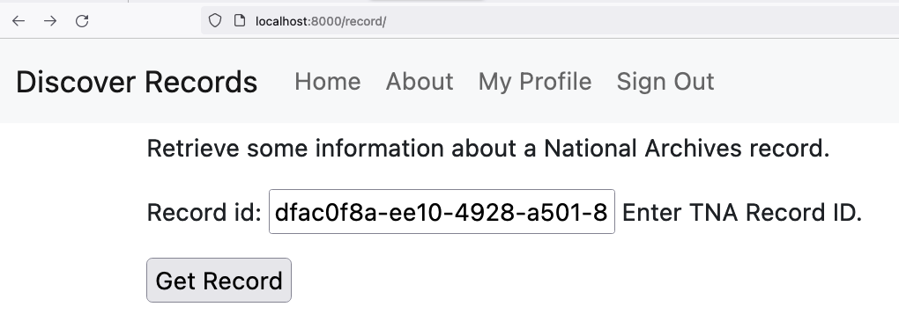
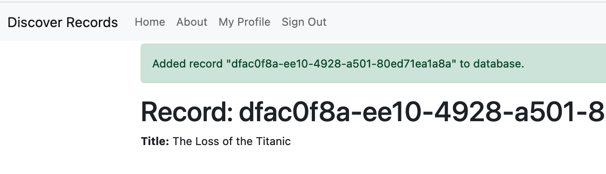
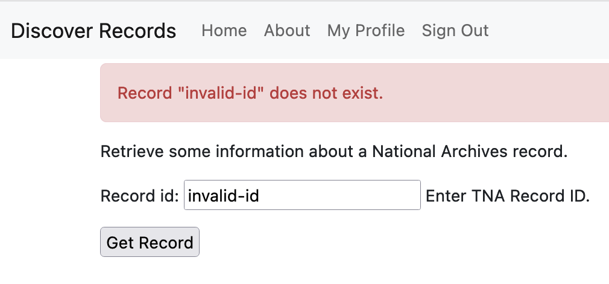

# Discover Records

Retrieve and present records from The National Archives Discovery API.

License: MIT

## Introduction

The National Archives Discovery API (https://discovery.nationalarchives.gov.uk/API) is a web API for accessing records
in JSON format.

The 'Discover Records' Django app provides a web interface to retrieve a record by id from the Discovery API, insert
it into the database and view some information about the record.

### Notes

- This is an example app that should _not_ be run in production. The management command 'importrecord', which has direct access to the database, is available without authentication. Input and data validation are also minimal.
- A typical app of this kind would benefit from `pydantic` for data validation and should utilise type annotations with `mypy` to help prevent bugs.
- It has been assumed that the user will have knowledge of valid record ids.
- A minimal subset of record data has been written to the model in the interests of time to meet the minimum specifications.
- TDD was used for the management command 'importrecord' but there was insufficient time to write tests for web elements such as `views.py`. Overall test coverage, as measured by `coverage`, is 85%.

## Quick Start

Here are the steps to run the Django app locally in development mode.

### Prerequisites

This application runs in containers on Docker with Docker Compose. You should have installed Docker and Docker Compose.

### Build the Code

Clone this repository:

`$ git clone https://github.com/mchesterkadwell/discover_records.git`

Build the Docker stack with the local configuration. This make take a few minutes:

`$ docker compose -f local.yml build`

### Run the Application

Run the Docker stack with the local configuration:

`$ docker compose -f local.yml up`

Run the database migrations. They should run on startup, but just in case you can do it manually:

`$ docker compose -f local.yml run --rm django python manage.py migrate`

Create a superuser. It is not important what you choose here as we do not use authentication in the application:

`$ docker compose -f local.yml run --rm django python manage.py createsuperuser`

You can view the web application locally at: http://localhost:8000/record/

It is possible to run the management command 'importrecord' manually without the web UI. Replace `<id>` with the id
of the TNA record you wish to retrieve and add to the database.

`$ docker compose -f local.yml run --rm django python manage.py importrecord <id>`

### Run the Tests

To run the tests:

`$ docker compose -f local.yml run --rm django pytest`

## Use the Application

Go to http://localhost:8000/record/ and input a TNA record id into the field and press the 'Get Record' button. For example, you can try `dfac0f8a-ee10-4928-a501-80ed71ea1a8a`.

If the app can successfully retrieve the record it redirects to a page to show some information about the record.

If the id is not valid, so the Discovery API cannot retrieve a record, an error message is shown.

